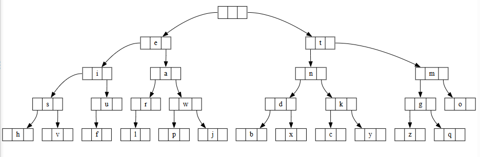

# Binary Tree Morse Code Converter


This project implements a Morse Code encoder and decoder in **Java**, utilizing a **Binary Tree** data structure to store and retrieve characters efficiently.

Developed as part of the **Algorithms and Data Structures I** course, aiming to deepen understanding of tree manipulation and traversal algorithms.

## 📋 About the Project

The core feature of this project is using a tree structure to represent the Morse alphabet, where the position of each letter is determined by the sequence of dots (`.`) and dashes (`-`).

### 🌲 The Tree Logic
The tree is built starting from an empty root node:
* **Left Child:** Represents a **dot (.)**
* **Right Child:** Represents a **dash (-)**

For example, to reach the letter **A** (`.-`):
1.  Start at the **Root**.
2.  Go **Left** (.).
3.  Go **Right** (-).
4.  Found the node containing 'A'.

<div align="center">
  
  <p><em>Visualization of the Morse Tree structure.</em></p>
</div>

## 🚀 Features

* **Encoding (Text -> Morse):** Receives a string and traverses the tree to find the corresponding code sequence.
* **Decoding (Morse -> Text):** Receives a Morse sequence and navigates the tree (Left/Right) to find the original character.
* **Visualization (DOT/GraphViz):** The code includes a `generateDOT` method, which produces an output compatible with GraphViz (or [WebGraphviz](http://www.webgraphviz.com/)) to visually render the tree structure.

## 🛠️ Technologies

* **Java** (Main language)
* **VS Code** (Recommended IDE)

## 📂 File Structure

* `src/App.java`: Main class that runs encoding and decoding tests.
* `src/MorseTree.java`: Class responsible for tree logic (insertion, search, `encode`, and `decode`).

## 💻 Usage

1.  Ensure you have **Java** installed.
2.  Compile and run `App.java`.

The program will execute the following automatic test:

```java
String msg = "exercicio bonus de algoritmos e estruturas de dados i";
String encoded = morse.encode(msg);
String decoded = morse.decode(encoded);

// Expected Output (Console):
// Morse Text: . -..- . .-. -.-. .. -.-. .. ---  -... --- -. ..- ...  -.. .  .- .-.. --. --- .-. .. - -- --- ...  .  . ... - .-. ..- - ..- .-. .- ...  -.. .  -.. .- -.. --- ...  ..
// Decoded Text: exercicio bonus de algoritmos e estruturas de dados i

